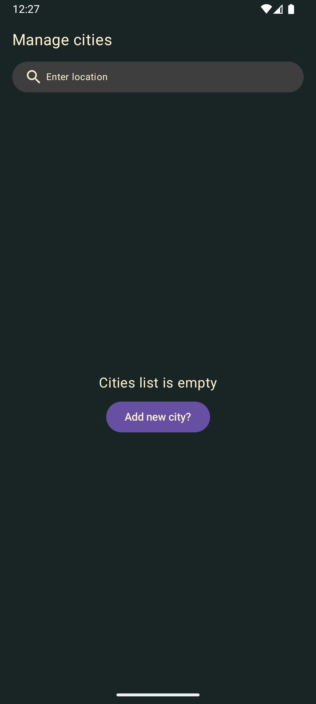
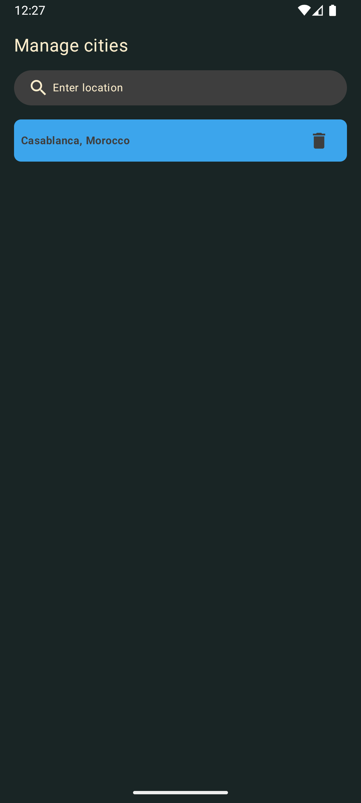
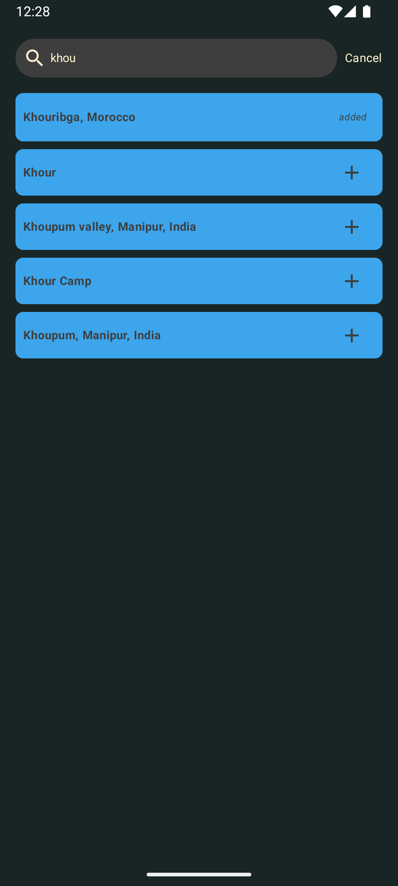

# Weather Application

## Key features

- List favorite cities
- Add new city to favorites
- Remove city from favorites
- Search cities using google places api
- Display city weather forecast

## Architecture

- Clean Architecture

## Stack

- kotlin
- Jetpack compose
- Dagger Hilt
- Room database
- Retrofit
- Coroutines
- Google Places API

## Demo Video

<video src="./assets/demonstration.mp4" controls></video>

## Empty Cities List Screen

## Cities List Screen

## Search Cities Screen

